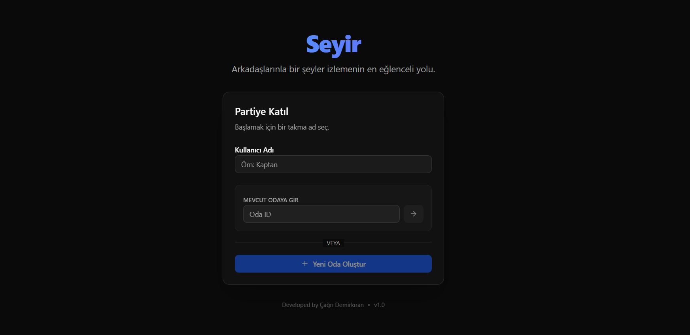
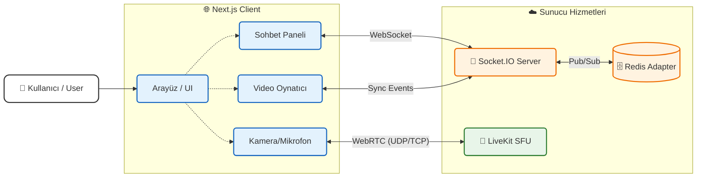
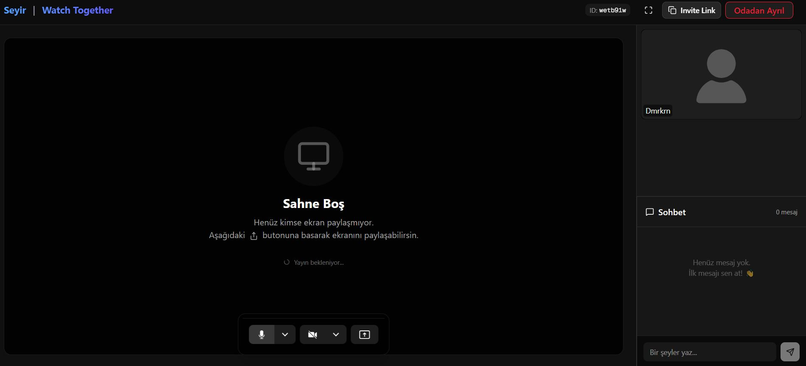
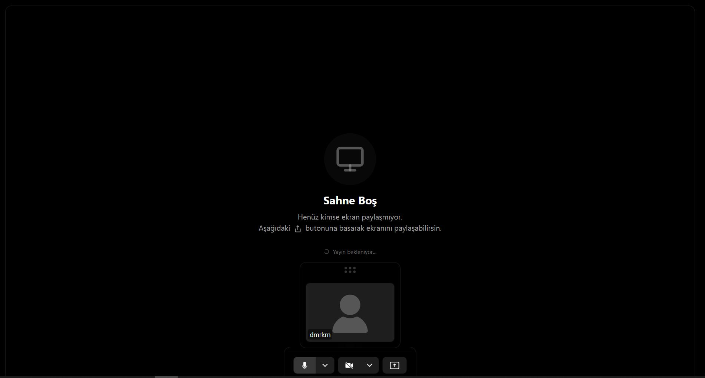

# Seyir | Watch Together 🎬

**Seyir**, arkadaşlarınızla aynı anda video izlemenizi, sohbet etmenizi ve gerçek zamanlı etkileşimde bulunmanızı sağlayan modern bir "Birlikte İzle" (Watch Party) uygulamasıdır.

<div align="center">


</div>



> **[🚀 Hemen Ücretsiz Kullanın / Try for Free: https://seyir-watch-together.vercel.app/](https://seyir-watch-together.vercel.app/)**
> *Kayıt olmadan, ücretsiz ve reklamsız. / No registration, free and ad-free.*

[🇹🇷 Türkçe](#-türkçe) • [🇺🇸 English](#-english)

---

## 🇹🇷 Türkçe

### 🌟 Özellikler

- **Senkronize Video Oynatma**: Videoyu durdurduğunuzda, sardığınızda veya oynattığınızda odadaki herkes için anında senkronize olur.
- **Sinema Modu (Tam Ekran)**: Filmi tam ekran yaptığınızda arkadaşlarınızın görüntüleri kaybolmaz! Kayan pencere sayesinde hem filmi tam ekran izleyebilir hem de arkadaşlarınızın tepkilerini görmeye devam edebilirsiniz.
  > *Arkadaşlarınızın kamerasını ekranın istediğiniz yerine sürükleyip bırakabilirsiniz.*
- **Sesli ve Görüntülü Görüşme (LiveKit)**: Sadece mesajlaşmakla kalmayın, arkadaşlarınızı görerek tepkilerini canlı izleyin.
- **Gerçek Zamanlı Sohbet**: Odadaki arkadaşlarınızla anlık mesajlaşın.
- **Ekran Paylaşımı**: Kendi ekranınızdaki herhangi bir içeriği odaya yansıtın.
- **Özel Odalar**: Size özel oluşturulan oda kodları ile davetsiz misafirlerden uzak durun.

### 🏗️ Mimari

Uygulama hibrit bir yapı kullanır. WebRTC tabanlı medya (ses/video) iletişimi için LiveKit, oda senkronizasyonu ve mesajlaşma için WebSocket (Socket.IO) kullanılır.



### 🛠️ Teknolojiler

| Kategori | Teknoloji | Açıklama |
|----------|-----------|----------|
| **Frontend** | [Next.js 14](https://nextjs.org/) | App Router ile modern React framework'ü. |
| **Dil** | TypeScript | Tip güvenli kod geliştirme. |
| **Styling** | TailwindCSS | Hızlı ve esnek stillendirme. |
| **Realtime** | Socket.IO | Odalar arası anlık veri senkronizasyonu. |
| **Medya** | LiveKit | WebRTC tabanlı yüksek kaliteli ses ve görüntü. |
| **DevOps** | Docker | Konteyner tabanlı dağıtım. |
| **Deploy** | Vercel & DigitalOcean | Frontend Vercel'de, Backend DigitalOcean'da dockerize. |

### 📸 Ekran Görüntüleri

| Karşılama Ekranı | İzleme Odası |
|-----------------|--------------|
|  |  |

> **Sinema Modu:**
> 

### 🌐 Neden Vercel Domain?

Projemizin frontend tarafı **seyir-watch-together.vercel.app** adresi üzerinden hizmet vermektedir. 
Projemiz **Açık Kaynak (Open Source)** felsefesiyle geliştirildiği için, herkesin ücretsiz ve hızlı bir şekilde kendi kopyasını kurabilmesini hedefledik. Backend tarafında ise güvenli iletişim (SSL) için kendi sunucumuzu yapılandırdık.
Amacımız ticari bir ürün satmak değil, **teknolojiyi ve eğlenceyi herkes için erişilebilir kılmaktır.**

### 🛠️ Kurulum (Local)

1.  **Repoyu klonlayın:**
    ```bash
    git clone https://github.com/Dmrkrn/seyir-watch-together.git
    cd seyir-watch-together
    ```

2.  **Paketleri yükleyin:**
    ```bash
    npm install
    ```

3.  **Başlatın:**
    ```bash
    npm run dev
    ```

---

## 🇺🇸 English

### 🌟 Features

- **Synchronized Video Playback**: Pause, seek, or play, and it syncs instantly for everyone in the room.
- **Cinema Mode (Fullscreen)**: Going fullscreen doesn't hide your friends! Drag and drop their video feeds anywhere on the screen while watching.
- **Voice & Video Chat (LiveKit)**: Don't just text; see your friends' reactions live with high-quality WebRTC video.
- **Real-time Chat**: Instant messaging with everyone in the room.
- **Screen Sharing**: Share any content from your screen with the room.
- **Private Rooms**: Secure, invite-only rooms with unique codes.

### 🏗️ Architecture

The app uses a hybrid architecture. LiveKit handles WebRTC-based media (audio/video), while Socket.IO manages room state synchronization and messaging.

*(See the diagram in the Turkish section above)*

### 🛠️ Tech Stack

| Category | Technology | Description |
|----------|------------|-------------|
| **Frontend** | [Next.js 14](https://nextjs.org/) | Modern React framework with App Router. |
| **Language** | TypeScript | Type-safe development. |
| **Styling** | TailwindCSS | Utility-first CSS framework. |
| **Realtime** | Socket.IO | Instant data sync and room management. |
| **Media** | LiveKit | High-quality WebRTC audio/video infrastructure. |
| **DevOps** | Docker | Containerized deployment. |

### 📸 Screenshots

*(See the screenshots in the Turkish section above)*

### 🛠️ Installation (Local)

1.  **Clone the repo:**
    ```bash
    git clone https://github.com/Dmrkrn/seyir-watch-together.git
    cd seyir-watch-together
    ```

2.  **Install dependencies:**
    ```bash
    npm install
    ```

3.  **Run:**
    ```bash
    npm run dev
    ```

---

## 📄 License

This project is licensed under the MIT License. Feel free to use, modify, and distribute it as you wish.

---
*Developed with ❤️ by Çağrı Demirkıran*
