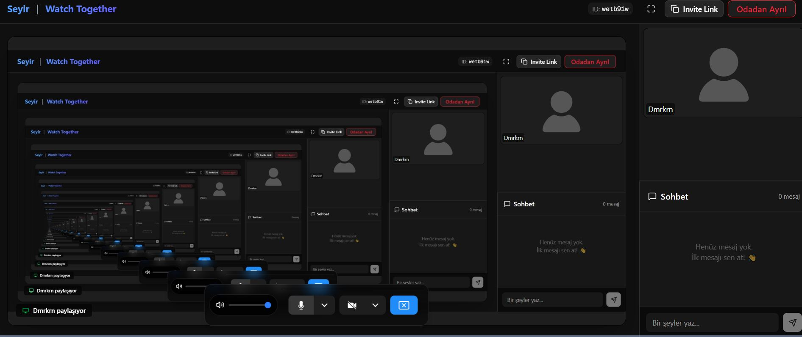

# Seyir | Watch Together 🎬

**Seyir**, arkadaşlarınızla aynı anda video izlemenizi, sohbet etmenizi ve gerçek zamanlı etkileşimde bulunmanızı sağlayan modern bir "Birlikte İzle" (Watch Party) uygulamasıdır. 

Next.js, Socket.IO ve LiveKit kullanılarak geliştirilmiş hibrit bir mimariye sahiptir.


<div align="center">


</div>

> **[🚀 Hemen Ücretsiz Kullanın: https://seyir-watch-together.vercel.app/](https://seyir-watch-together.vercel.app/)**
> *Kayıt olmadan, ücretsiz ve reklamsız.*

## 🌟 Özellikler

- **Senkronize Video Oynatma**: Videoyu durdurduğunuzda, sardığınızda veya oynattığınızda odadaki herkes için anında senkronize olur.
- **Sinema Modu (Tam Ekran)**: Filmi tam ekran yaptığınızda arkadaşlarınızın görüntüleri kaybolmaz! Kayan pencere sayesinde hem filmi tam ekran izleyebilir hem de arkadaşlarınızın tepkilerini görmeye devam edebilirsiniz.
  > *Arkadaşlarınızın kamerasını ekranın istediğiniz yerine sürükleyip bırakabilirsiniz.*
  

- **Sesli ve Görüntülü Görüşme (LiveKit)**: Sadece mesajlaşmakla kalmayın, arkadaşlarınızı görerek tepkilerini canlı izleyin.
- **Gerçek Zamanlı Sohbet**: Odadaki arkadaşlarınızla anlık mesajlaşın.
- **Ekran Paylaşımı**: Kendi ekranınızdaki herhangi bir içeriği odaya yansıtın.
- **Özel Odalar**: Size özel oluşturulan oda kodları ile davetsiz misafirlerden uzak durun.

## 🚀 Teknoloji Yığını

Bu proje, performans ve gerçek zamanlı iletişim için en modern teknolojileri bir araya getirir:

- **Frontend**: [Next.js 14](https://nextjs.org/) (App Router), TypeScript, Tailwind CSS
- **Backend (Signaling)**: Node.js, Socket.IO (DigitalOcean üzerinde Dockerize edilmiş)
- **Real-time Media**: [LiveKit](https://livekit.io/) (WebRTC tabanlı ses/video)
- **Deployment**: Vercel (Frontend) + DigitalOcean (Backend)

## 🌐 Neden Vercel Domain?

Projemizin frontend tarafı **seyir-watch-together.vercel.app** adresi üzerinden hizmet vermektedir. 

Projemiz **Açık Kaynak (Open Source)** felsefesiyle geliştirildiği için, herkesin ücretsiz ve hızlı bir şekilde kendi kopyasını kurabilmesini hedefledik. Bu nedenle frontend tarafında özel bir domain ("katı" bir kurumsal yapı) satın almak yerine, geliştirici dostu ve ücretsiz olan Vercel altyapısını tercih ettik. Backend tarafında ise güvenli iletişim (SSL) için kendi sunucumuzu yapılandırdık.

Amacımız ticari bir ürün satmak değil, **teknolojiyi ve eğlenceyi herkes için erişilebilir kılmaktır.**

## 📸 Ekran Görüntüleri

### Karşılama Ekranı
Modern ve sade arayüz ile saniyeler içinde yeni bir oda oluşturun.


### İzleme Odası
Videolar tam senkronize, sohbet ve katılımcı listesi elinizin altında.


### Sinema Modu


## 🛠️ Kurulum (Local)

Kendi bilgisayarınızda çalıştırmak için:

1.  Repoyu klonlayın:
    ```bash
    git clone https://github.com/Dmrkrn/seyir-watch-together.git
    cd seyir-watch-together
    ```

2.  Paketleri yükleyin:
    ```bash
    npm install
    ```

3.  Gerekli `.env` dosyalarını oluşturun ve projeyi başlatın:
    ```bash
    npm run dev
    ```

## 📄 Lisans

Bu proje MIT lisansı ile lisanslanmıştır. Dilediğiniz gibi kullanabilir, geliştirebilir ve dağıtabilirsiniz.

---
*Developed with ❤️ by Çağrı Demirkıran*
