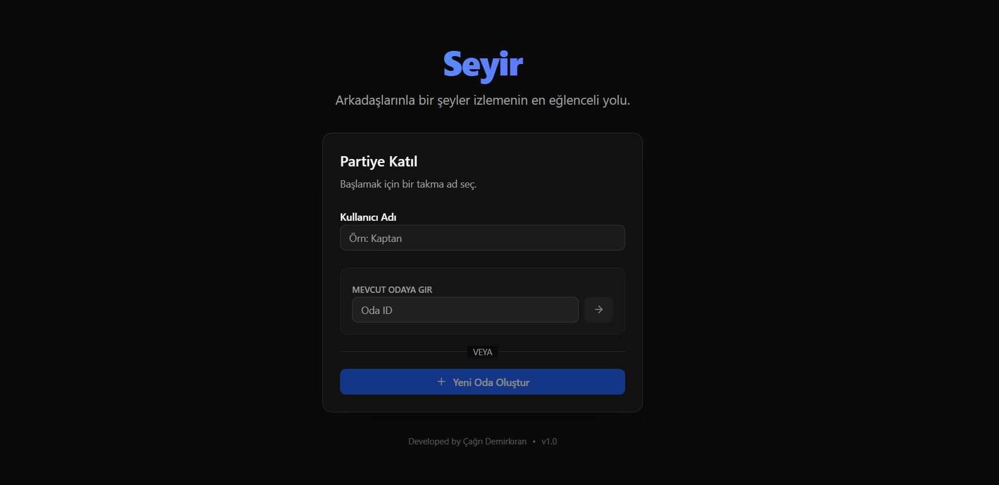
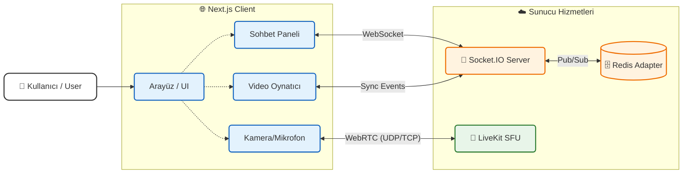
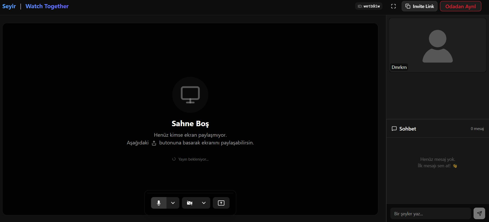
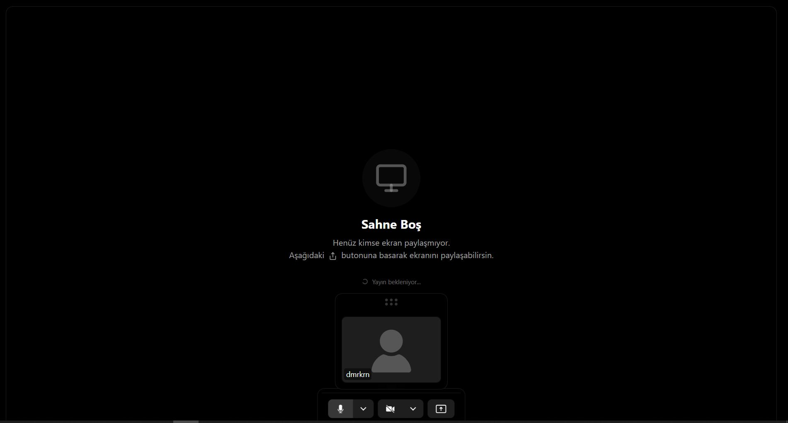

# Seyir | Watch Together 🎬

**Seyir**, arkadaşlarınızla aynı anda video izlemenizi, sohbet etmenizi ve gerçek zamanlı etkileşimde bulunmanızı sağlayan modern bir "Birlikte İzle" (Watch Party) uygulamasıdır.

<div align="center">


</div>



> **[🚀 Hemen Ücretsiz Kullanın / Try for Free: https://seyir.cagridemirkiran.com/](https://seyir.cagridemirkiran.com/)**
> *Kayıt olmadan, ücretsiz ve reklamsız. / No registration, free and ad-free.*

[🇹🇷 Türkçe](#-türkçe) • [🇺🇸 English](#-english)

---

## 🇹🇷 Türkçe

### 🌟 Özellikler

- **Yayıncı/İzleyici Modeli**: Bir kişi ekranını paylaşır, diğerleri izler. Gereksiz senkronizasyon yükü olmadan akıcı bir deneyim sunar.
- **Sinema Modu (Tam Ekran)**: Filmi tam ekran yaptığınızda arkadaşlarınızın görüntüleri kaybolmaz! Kayan pencere sayesinde hem filmi tam ekran izleyebilir hem de arkadaşlarınızın tepkilerini görmeye devam edebilirsiniz.
  > *Arkadaşlarınızın kamerasını ekranın istediğiniz yerine sürükleyip bırakabilirsiniz.*
- **Sesli ve Görüntülü Görüşme (LiveKit)**: Sadece mesajlaşmakla kalmayın, arkadaşlarınızı görerek tepkilerini canlı izleyin.
- **Anlık Sohbet & İletişim**: Socket.IO üzerinden çalışan hızlı ve kesintisiz mesajlaşma.
- **Ekran Paylaşımı**: Kendi ekranınızdaki herhangi bir içeriği odaya yansıtın (İzleyiciler için optimize edildi).
- **Özel Odalar**: Size özel oluşturulan oda kodları ile davetsiz misafirlerden uzak durun.

### 🏗️ Mimari

Uygulama hibrit bir yapı kullanır. WebRTC tabanlı medya (ses/video) iletişimi için LiveKit, oda senkronizasyonu ve mesajlaşma için WebSocket (Socket.IO) kullanılır.


```mermaid
graph LR
    User[👤 Kullanıcı / User]
    
    subgraph Frontend [🌐 Next.js Client]
        direction TB
        UI[Arayüz / UI]
        VideoPlayer[Video Oynatıcı]
        Chat[Sohbet Paneli]
        MediaStream[Kamera/Mikrofon]
    end

    subgraph Backend [☁️ Sunucu Hizmetleri]
        direction TB
        Signaling[📡 Socket.IO Server]
        MediaServer[🎥 LiveKit SFU]
        DB[(🗄️ Redis Adapter)]
    end

    User --> UI
    
    %% Internal UI
    UI -.-> VideoPlayer
    UI -.-> Chat
    UI -.-> MediaStream

    %% Network Connections
    Chat <-->|WebSocket| Signaling
    VideoPlayer <-->|Sync Events| Signaling
    MediaStream <-->|"WebRTC (UDP/TCP)"| MediaServer
    
    %% Backend Internal
    Signaling <-->|Pub/Sub| DB

    %% Styles
    classDef user fill:#ffffff,stroke:#333,stroke-width:2px,rx:10,ry:10;
    classDef client fill:#e3f2fd,stroke:#1565c0,stroke-width:2px,rx:5,ry:5;
    classDef server fill:#fff3e0,stroke:#ef6c00,stroke-width:2px,rx:5,ry:5;
    classDef media fill:#e8f5e9,stroke:#2e7d32,stroke-width:2px,rx:5,ry:5;
    
    class User user;
    class UI,VideoPlayer,Chat,MediaStream client;
    class Signaling,DB server;
    class MediaServer media;
```

### 🛠️ Teknolojiler

| Kategori | Teknoloji | Açıklama |
|----------|-----------|----------|
| **Frontend** | [Next.js 14](https://nextjs.org/) | App Router ile modern React framework'ü. |
| **Dil** | TypeScript | Tip güvenli kod geliştirme. |
| **Styling** | TailwindCSS | Hızlı ve esnek stillendirme. |
| **Realtime** | Socket.IO | Odalar arası anlık veri senkronizasyonu. |
| **Medya** | LiveKit | WebRTC tabanlı yüksek kaliteli ses ve görüntü. |
| **DevOps** | Docker | Konteyner tabanlı dağıtım. |
| **Deploy** | DigitalOcean (VPS) | Docker ile tam izole, güvenli ve performanslı sunucu yapısı. |

### 📸 Ekran Görüntüleri

| Karşılama Ekranı | İzleme Odası |
|-----------------|--------------|
|  |  |

> **Sinema Modu:**
> 

### 🌐 Neden Kendi Sunucumuz?

Projemizin frontend tarafı **seyir.cagridemirkiran.com** adresi üzerinden hizmet vermektedir. 
En iyi deneyimi sunabilmek için projeyi kendi sunucumuzda barındırıyoruz. Bu sayede **"Watch Party" (Birlikte İzle)** özelliğinde gerekli olan anlık senkronizasyon (Socket.IO) ve yüksek performanslı video aktarımı sorunsuz çalışmaktadır. Açık kaynak felsefesinden ödün vermeden, size hem ücretsiz hem de tam özellikli bir platform sunuyoruz.
Amacımız ticari bir ürün satmak değil, **teknolojiyi ve eğlenceyi herkes için erişilebilir kılmaktır.**

### 🛠️ Kurulum (Local)

1.  **Repoyu klonlayın:**
    ```bash
    git clone https://github.com/Dmrkrn/seyir-watch-together.git
    cd seyir-watch-together
    ```

2.  **Paketleri yükleyin:**
    ```bash
    npm install
    ```

3.  **Başlatın:**
    ```bash
    npm run dev
    ```

---

## 🇺🇸 English

### 🌟 Features

- **Broadcaster/Viewer Model**: One person shares, others watch. Smooth experience without unnecessary sync overhead.
- **Cinema Mode (Fullscreen)**: Going fullscreen doesn't hide your friends! Drag and drop their video feeds anywhere on the screen while watching.
- **Voice & Video Chat (LiveKit)**: Don't just text; see your friends' reactions live with high-quality WebRTC video.
- **Chat & Communication**: Fast and seamless messaging powered by Socket.IO.
- **Screen Sharing**: Share any content from your screen (Optimized for Viewer experience).
- **Private Rooms**: Secure, invite-only rooms with unique codes.

### 🏗️ Architecture

The app uses a hybrid architecture. LiveKit handles WebRTC-based media (audio/video), while Socket.IO manages room state synchronization and messaging.

*(See the diagram in the Turkish section above)*

### 🛠️ Tech Stack

| Category | Technology | Description |
|----------|------------|-------------|
| **Frontend** | [Next.js 14](https://nextjs.org/) | Modern React framework with App Router. |
| **Language** | TypeScript | Type-safe development. |
| **Styling** | TailwindCSS | Utility-first CSS framework. |
| **Realtime** | Socket.IO | Instant data sync and room management. |
| **Media** | LiveKit | High-quality WebRTC audio/video infrastructure. |
| **Deploy** | DigitalOcean (VPS) | Fully isolated, secure, and performant server structure with Docker. |

### 📸 Screenshots

*(See the screenshots in the Turkish section above)*

### 🛠️ Installation (Local)

1.  **Clone the repo:**
    ```bash
    git clone https://github.com/Dmrkrn/seyir-watch-together.git
    cd seyir-watch-together
    ```

2.  **Install dependencies:**
    ```bash
    npm install
    ```

3.  **Run:**
    ```bash
    npm run dev
    ```

---

## 📄 License

This project is licensed under the MIT License. Feel free to use, modify, and distribute it as you wish.

---
